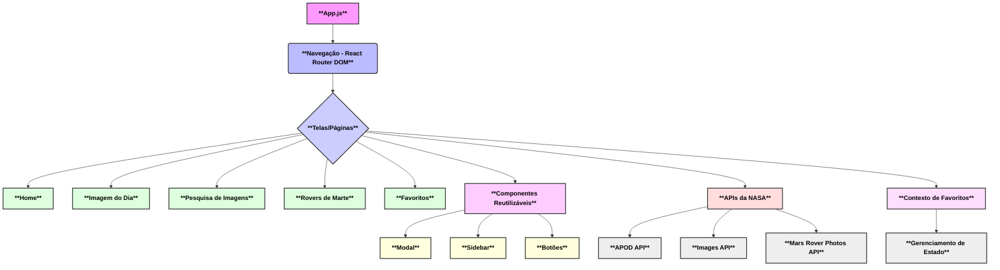

# 🚀 Galeria NASA: Uma Jornada Espacial no Seu Navegador! 🌌

Bem-vindo(a) à **Galeria NASA**, um projeto React que te leva para uma viagem intergaláctica sem sair do seu navegador! 🌠 Explore as maravilhas do universo através das APIs da NASA, com uma interface intuitiva e cheia de funcionalidades. Prepare-se para desvendar os segredos do cosmos! ✨

## 🌟 Funcionalidades Incríveis!

Nossa galeria oferece uma experiência rica e envolvente, com recursos que vão te deixar de queixo caído:

*   **🔭 Imagem Astronômica do Dia (APOD):**
    *   Visualize a imagem ou vídeo astronômico diário selecionado pela NASA, acompanhado de uma explicação detalhada escrita por um astrônomo. É uma dose diária de conhecimento e beleza cósmica! 🗓️
    *   **Por que APOD?** É a porta de entrada perfeita para o universo, oferecendo conteúdo novo e fascinante todos os dias.

*   **🔍 Pesquisa na Biblioteca de Imagens e Vídeos da NASA:**
    *   Mergulhe em uma vasta coleção de imagens e vídeos da NASA! Pesquise por palavras-chave e descubra momentos históricos, paisagens planetárias e muito mais. 📸
    *   **Por que a Biblioteca?** Permite uma exploração aprofundada e personalizada do acervo da NASA, atendendo à curiosidade de cada usuário.

*   **🚗 Fotos dos Rovers de Marte:**
    *   Acompanhe as aventuras dos nossos rovers em Marte! Navegue pelas fotos tiradas por Curiosity, Opportunity e Spirit em diferentes sóis (dias marcianos). Veja o Planeta Vermelho de perto! 🔴
    *   **Por que Rovers de Marte?** Conecta o usuário às missões espaciais atuais e históricas, mostrando o progresso da exploração robótica.

*   **❤️ Favoritos:**
    *   Encontrou uma imagem que te tirou o fôlego? Adicione-a aos seus favoritos para revisitá-la quando quiser! Sua coleção pessoal de maravilhas espaciais. ⭐
    *   **Por que Favoritos?** Melhora a experiência do usuário, permitindo que ele personalize e salve o conteúdo que mais o interessa.

## 🛠️ Tecnologias Utilizadas: O Coração do Projeto

Construído com as melhores ferramentas para garantir performance e uma experiência de usuário fluida:

*   **React:** A biblioteca JavaScript para construir interfaces de usuário dinâmicas e reativas. ⚛️
*   **Axios:** Um cliente HTTP baseado em Promises para fazer requisições às APIs da NASA de forma eficiente. 📡
*   **Bootstrap:** Um framework CSS popular para um design responsivo e elegante, garantindo que a galeria fique ótima em qualquer dispositivo. 🎨
*   **React Router DOM:** Para gerenciar a navegação entre as diferentes seções da aplicação de forma declarativa. 🛣️
*   **React Icons:** Uma vasta biblioteca de ícones para uma interface mais visual e intuitiva. 🖼️
*   **React Input Mask:** Para formatação de entrada de dados, como datas, garantindo a usabilidade. 📝

## 🏗️ Arquitetura do Projeto: Como Tudo se Conecta

A arquitetura da Galeria NASA foi pensada para ser modular, escalável e de fácil manutenção. Utilizamos uma abordagem baseada em componentes React, com uma clara separação de responsabilidades.



### 🧠 Razões por Trás das Decisões Arquiteturais:

*   **Componentização com React:**
    *   **Decisão:** Utilizar React para construir a interface do usuário.
    *   **Razão:** Permite a criação de componentes reutilizáveis e independentes, facilitando o desenvolvimento, a manutenção e a escalabilidade. Cada parte da UI (botões, modais, seções de conteúdo) é um componente, promovendo a organização e a legibilidade do código.

*   **Gerenciamento de Estado com Context API (para Favoritos):**
    *   **Decisão:** Implementar um `FavoritesContext.js` para gerenciar o estado dos itens favoritos.
    *   **Razão:** Para um estado global simples como a lista de favoritos, a Context API do React é uma solução leve e eficiente. Evita o "prop drilling" (passar props por muitos níveis de componentes) e centraliza a lógica de adicionar/remover favoritos, tornando-a acessível a qualquer componente que precise dela.

*   **Estrutura de Pastas Lógica:**
    *   **Decisão:** Organizar o código em pastas como `api`, `assets`, `components`, `context`, `screens`, `shared`.
    *   **Razão:** Promove a separação de responsabilidades e a clareza do projeto.
        *   `api`: Contém a lógica de interação com as APIs externas.
        *   `assets`: Armazena recursos estáticos como imagens e ícones.
        *   `components`: Guarda componentes React reutilizáveis em toda a aplicação.
        *   `context`: Gerencia o estado global da aplicação.
        *   `screens`: Define as diferentes "páginas" ou visualizações principais da aplicação.
        *   `shared`: Contém estilos globais ou utilitários compartilhados.
    *   Essa estrutura facilita a localização de arquivos e a compreensão do fluxo da aplicação para novos desenvolvedores.

*   **Uso de Variáveis de Ambiente para Chaves de API:**
    *   **Decisão:** Utilizar `process.env.REACT_APP_NASA_API_KEY` para armazenar a chave da API.
    *   **Razão:** Segurança e flexibilidade. Evita que a chave da API seja exposta diretamente no código-fonte e permite que diferentes chaves sejam usadas em ambientes de desenvolvimento e produção sem a necessidade de alterar o código.

## 📂 Estrutura de Pastas: Um Olhar Detalhado

```
NASA_Galery/
├── .env                    # Variáveis de ambiente (ex: chaves de API)
├── public/                 # Arquivos estáticos públicos (index.html, favicons)
├── src/                    # Código fonte da aplicação
│   ├── api/                # Módulos para interação com as APIs da NASA (APOD, Imagens, Rovers)
│   │   ├── apod.js
│   │   ├── images.js
│   │   └── marsRover.js
│   ├── assets/             # Recursos estáticos (imagens, logos)
│   │   ├── nasa-logo.svg
│   │   └── profile-image.jpg
│   ├── components/         # Componentes React reutilizáveis
│   │   ├── modal/          # Componente de Modal
│   │   │   ├── index.js
│   │   │   └── modal.css
│   │   └── sidebar/        # Componente de Sidebar de navegação
│   │       ├── index.js
│   │       ├── sidebar.css
│   │       ├── sidebarButton.css
│   │       └── sidebarButton.js
│   ├── context/            # Contextos React para gerenciamento de estado global
│   │   └── FavoritesContext.js # Contexto para gerenciar itens favoritos
│   ├── screens/            # Telas/Páginas principais da aplicação
│   │   ├── favorites/      # Tela de Favoritos
│   │   │   ├── favorites.css
│   │   │   └── index.js
│   │   ├── freeSearch/     # Tela de Pesquisa Livre (se aplicável)
│   │   │   ├── freeSearch.css
│   │   │   └── index.js
│   │   ├── home/           # Tela Inicial
│   │   │   ├── home.css
│   │   │   └── index.js
│   │   ├── imageDay/       # Tela da Imagem Astronômica do Dia (APOD)
│   │   │   ├── imageDay.css
│   │   │   └── index.js
│   │   ├── imageSearch/    # Tela de Pesquisa de Imagens da NASA
│   │   │   ├── imageSearch.css
│   │   │   └── index.js
│   │   └── imageView/      # Tela de Visualização de Imagem Detalhada
│   │       ├── imageView.css
│   │       └── index.js
│   ├── shared/             # Estilos ou utilitários compartilhados
│   │   └── globalStyles.css
│   ├── App.js              # Componente principal da aplicação
│   ├── index.css           # Estilos globais
│   ├── index.js            # Ponto de entrada da aplicação
│   ├── reportWebVitals.js  # Relatório de métricas de desempenho web
│   └── setupTests.js       # Configuração de testes
├── .gitignore              # Arquivos e pastas a serem ignorados pelo Git
├── package.json            # Metadados do projeto e dependências
├── package-lock.json       # Bloqueio de versões de dependências
├── README.md               # Este arquivo!
└── ... (outros arquivos de configuração e build)
```

## 🚀 Configuração e Instalação: Comece Sua Jornada!

Este projeto está implantado no GitHub Pages e pode ser acessado em: [https://dessima.github.io/NASA_Galery](https://dessima.github.io/NASA_Galery)

Para colocar este projeto em funcionamento em sua máquina local e começar a explorar o universo, siga estes passos simples:

1.  **Clone o repositório:**
    ```bash
    git clone https://github.com/dessima/NASA_Galery.git
    cd NASA_Galery
    ```

2.  **Instale as dependências:**
    ```bash
    npm install
    ```

3.  **Configure a Chave da API da NASA (Opcional, mas Recomendado):**
    Algumas funcionalidades incríveis, como a Imagem Astronômica do Dia (APOD) e as Fotos dos Rovers de Marte, utilizam a API da NASA. Embora uma `DEMO_KEY` seja fornecida por padrão, ela possui limites de taxa que podem impactar sua experiência. Para uma exploração sem limites, é **altamente recomendado** obter sua própria chave de API gratuita em [NASA API](https://api.nasa.gov/) e configurá-la:

    Crie um arquivo `.env` na raiz do diretório do projeto (se ainda não existir) e adicione sua chave de API da seguinte forma:
    ```
    REACT_APP_NASA_API_KEY=SUA_CHAVE_DA_API_DA_NASA
    ```
    ⚠️ **Importante:** Nunca compartilhe sua chave de API publicamente! O arquivo `.env` é automaticamente ignorado pelo Git para sua segurança.

## 🏃‍♀️ Scripts Disponíveis: Dê Vida ao Projeto!

No diretório do projeto, você pode executar os seguintes comandos:

### `npm start`

Inicia o aplicativo em modo de desenvolvimento. 🧑‍💻
Abra [http://localhost:3000](http://localhost:3000) no seu navegador para ver a galeria em ação!
A página será recarregada automaticamente sempre que você fizer alterações no código. Você também poderá ver quaisquer erros de lint diretamente no console.

### `npm test`

Inicia o executor de testes no modo de observação interativo. 🧪
Para mais detalhes sobre como executar e escrever testes, consulte a seção sobre [execução de testes](https://facebook.github.io/create-react-app/docs/running-tests) na documentação do Create React App.

### `npm run build`

Compila o aplicativo para produção na pasta `build`. 📦
Este comando otimiza o React para o ambiente de produção, minificando o código e garantindo o melhor desempenho possível. Os nomes dos arquivos de saída incluirão hashes para cache busting.
Seu aplicativo estará pronto para ser implantado em um servidor web! 🚀
Para mais informações sobre implantação, consulte a seção sobre [implantação](https://facebook.github.io/create-react-app/docs/deployment).

### `npm run eject`

**Cuidado! Esta é uma operação unidirecional. Uma vez que você `eject`, não há como voltar!** 🚨

Se você precisar de controle total sobre a configuração de build (webpack, Babel, ESLint, etc.), este comando removerá a dependência única do `react-scripts` do seu projeto. Ele copiará todos os arquivos de configuração e dependências transitivas diretamente para o seu projeto. A partir daí, você terá controle total para personalizar a configuração.
Você não é obrigado(a) a usar `eject`. Para a maioria dos projetos, a configuração padrão do Create React App é mais do que suficiente.

## 🤝 Como Contribuir: Junte-se à Missão!

Adoramos contribuições! Se você tem ideias para novas funcionalidades, encontrou um bug ou quer melhorar o código, sinta-se à vontade para:

1.  Fazer um fork do repositório.
2.  Criar uma nova branch (`git checkout -b feature/sua-feature`).
3.  Fazer suas alterações e testá-las.
4.  Fazer commit das suas alterações (`git commit -m 'feat: Adiciona nova funcionalidade X'`).
5.  Fazer push para a branch (`git push origin feature/sua-feature`).
6.  Abrir um Pull Request.

Por favor, certifique-se de que seu código siga as convenções existentes e que todos os testes passem.

## 📄 Licença

Este projeto está licenciado sob a Licença MIT. Veja o arquivo [LICENSE](LICENSE) para mais detalhes.

## 📚 Saiba Mais: Aprofunde Seus Conhecimentos

*   Você pode aprender mais sobre o Create React App na [documentação oficial](https://facebook.github.io/create-react-app/docs/getting-started).
*   Para dominar o React, confira a [documentação do React](https://reactjs.org/).
*   Explore as incríveis APIs da NASA em [api.nasa.gov](https://api.nasa.gov/).

---

Feito com ❤️ e muita curiosidade espacial! 🚀✨
